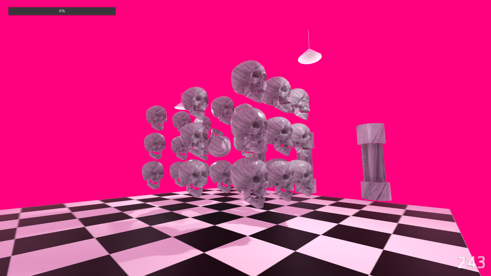

# Vaporware 1: A Puzzle Game

A puzzle game, name may be changed. Built in godot 3.2.1 stable

## Levels

You will be notified that you have won the level by text displaying in the scene telling you that you have solved the puzzle. Shortly thereafter you will be directed to the debug level select.

### 01 Skulls

puzzles/puzzle_01.tscn is the first level, get all skulls in the same rotation to win.'

### 02 Ghost

puzzles/puzzle_02.tscn is the second level. No hints provided.

### 03 Saving Throw

puzzles/puzzle_03.tscn is the third level. No hints provided.

# License

Licenses for various things used

## 3D FPP Interaction Template

Copyright (c) 2018 TheRadMatt, MIT License

## EverythingLibrary_Animals.zip

LICENSE
Software applications: MIT License (2020) 
Creative: Creative Commons Attribution 4.0 International License

Short version: credit “Everything Library © David OReilly” somewhere when you release things. If posting work to social media you can tag me if you like… no pressure.

## Textures

Got a marble texture (public domain) courtesy photos-public-domain.com
